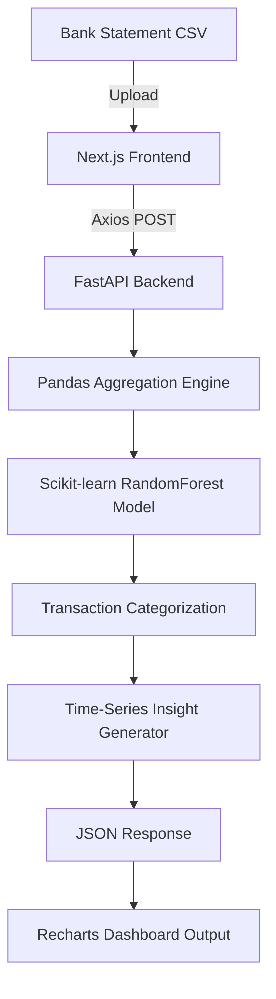

# AI-Powered Personal Finance Intelligence System

**Automated Budgeting, Machine Learning Categorization, and Smart Financial Analytics**

## Overview

**AI-Powered Personal Finance Intelligence System** is a full-stack, production-ready application designed to transform messy bank statements into actionable financial insights. 

Instead of forcing users to manually track receipts in a spreadsheet, the system leverages a robust **Machine Learning pipeline** to automatically categorize transactions, aggregate spending behaviors, and analyze financial velocity. It translates raw data into extremely visual, dynamic dashboards paired with intelligent, text-based financial advice—effectively serving as an automated personal financial advisor.

The platform is designed with a premium, fully customized **Peacock Green & Neon Glassmorphism** aesthetic, entirely written in Vanilla CSS and optimized for deployment on Vercel and Render.

---

## Core Capabilities

- **Intelligent Transaction Categorization**: Utilizes a trained `RandomForestClassifier` combined with `TfidfVectorizer` to accurately parse and classify complex, unstructured English transaction texts (e.g., mapping `UBER *TRIP` to `Transportation`).
- **Batch CSV Analysis**: Robust engine capable of parsing thousands of rows instantly, calculating aggregations, detecting income vs. expenses, and mapping numeric allocations.
- **Smart Time-Series Insights**: Automatically groups data by month to calculate spending trajectories and generates explicit warnings (e.g., *"⚠️ Entertainment spending increased by 20% compared to last month"*).
- **Interactive Visual Dashboard**: High-fidelity data visualization using **Recharts**, explicitly graphing categorical distribution via dynamic Pie Charts and Bar Charts.
- **Real-Time Input Validation**: Instantly categorize single transactions via an integrated manual input module.
- **Isolated Stack Architecture**: 100% decoupled frontend and backend for immense scalability and clean codebase practices.

---

## Architecture Flow



---

## Demo

### Working Model Preview

*A preview of the AI-Powered Personal Finance Intelligence System categorizing transactions and generating interactive visual insights in real-time.*

---

## Tech Stack

- **Frontend**: Next.js (App Router), React, Recharts, Custom Vanilla CSS
- **Backend**: FastAPI, Uvicorn, Python
- **Machine Learning**: Scikit-Learn, Joblib
- **Data Processing**: Pandas, NumPy

---

## Project Structure

```text
AI-Powered-Personal-Finance-Intelligence-System/
│
├── backend/                  # FastAPI & ML Processing
│   ├── app/
│   │   ├── main.py           # Uvicorn Entry Point
│   │   ├── routes/           # Endpoint Configurations
│   │   ├── services/         # ML Logic & Financial Analytics Engine
│   │   └── models/           # Scikit-Learn Training Scripts & PKL states
│   └── requirements.txt
│
├── frontend/                 # Next.js Presentation Layer
│   ├── app/                  # Pages, Layouts, and Vanilla Global CSS
│   ├── components/           # Uploaders, Input Modules, Recharts Dashboard
│   ├── public/               # Logos and Assets
│   └── services/             # Environment Variable & Protocol Parsing
│
├── data/                     # Local dataset used for ML Training
├── assets/                   # Project tracking media and demo GIFs
├── .gitignore
└── README.md
```

---

## Installation & Setup

1. **Clone the repository** to your local environment.

### Backend Setup (Machine Learning API)
2. Navigate to the backend directory and install the Python dependencies:
   ```bash
   cd backend
   pip install -r requirements.txt
   ```
3. **Train the ML Model**: Execute the training script to parse the local data and output your `saved_model.pkl`.
   ```bash
   python app/models/train.py
   ```
4. **Boot the API**: Start the FastAPI server on port 8000.
   ```bash
   uvicorn app.main:app --host 0.0.0.0 --port 8000 --reload
   ```

### Frontend Setup (Next.js Dashboard)
5. Open a new terminal window, navigate into the frontend, and install Node dependencies:
   ```bash
   cd frontend
   npm install
   ```
6. **Launch the UI**:
   ```bash
   npm run dev
   ```
   *The system is now live at `http://localhost:3000`.*

---

## Production Deployment

This project was built explicitly using a **Split Architecture Model**, optimizing it perfectly for frictionless, free-tier serverless deployments.

### 1. Deploy the Backend (Render / Railway)
- Create a new "Web Service" tied to your GitHub repository.
- Root Directory: `backend`
- Build Command: `pip install -r requirements.txt && python app/models/train.py`
- Start Command: `uvicorn app.main:app --host 0.0.0.0 --port $PORT`

### 2. Deploy the Frontend (Vercel)
- Create a new project in Vercel and import the exact same GitHub repository.
- Next.js is auto-detected. Set the Root Directory to `frontend`.
- **CRITICAL**: Add the `NEXT_PUBLIC_API_URL` environment variable and paste in the live production URL generated from your deployed Backend.
- Deploy!

---

## Why This Approach?
- **Zero Black-Box LLMs**: Operates entirely on explicit mathematical mapping via local Random Forest topologies instead of paying for OpenAI wrappers. This means 0ms latency and 100% data privacy.
- **Modular Data Engineering**: Analytics scripts are separated perfectly from the endpoint routing, retaining immense maintainability.
- **Premium Aesthetics First**: The customized Vanilla CSS design circumvents generic component libraries, rendering an application that feels like a multi-million-dollar FinTech startup immediately on launch.

---
*Built to transform raw spreadsheets into explicit financial intelligence using AI.*
